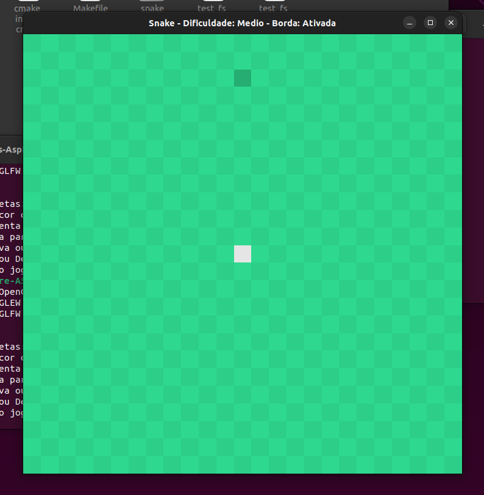
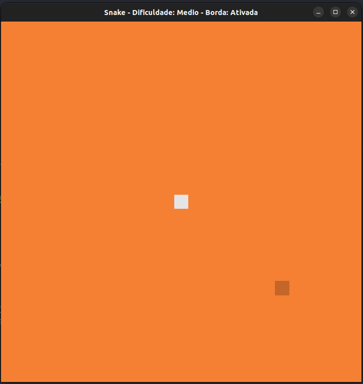
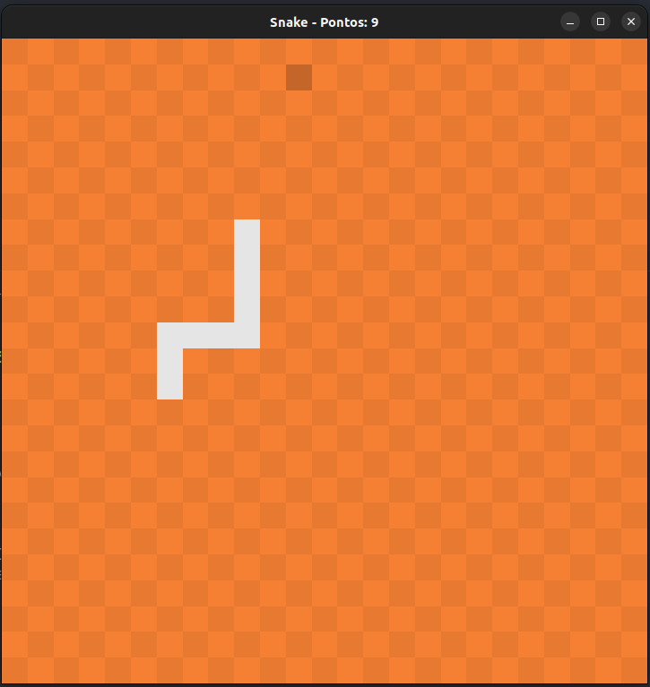
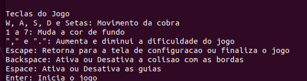

## Snake Game
Este projeto final foi desenvolvido para a disciplina de Introdução à Programação e consiste em uma implementação do clássico jogo da cobrinha (Snake).

## Tecnologias usadas

<div align="center">
  <a href="https://skillicons.dev">
    
  </a>
</div>

## Telas 








### Instruções



## Para executar:
```bash

