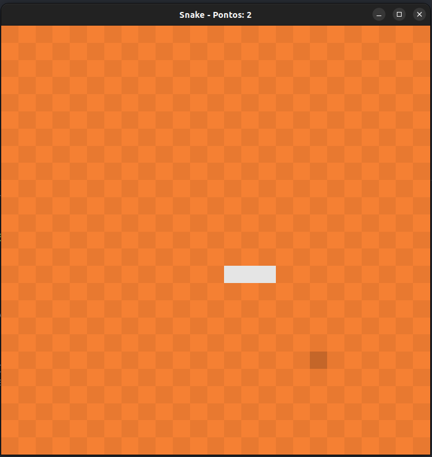

## Snake Game
Este projeto final foi desenvolvido para a disciplina de Introdução à Programação e consiste em uma implementação do clássico jogo da cobrinha (Snake).

## Tecnologias usadas

<div align="center">
  <a href="https://skillicons.dev">
    
  </a>
</div>

## Telas 




## Instruções


## Para executar:
```bash
```

## 💻 Autores

- [@Matheus](https://github.com/gauloish)
- [@Monik](https://github.com/MonikAlves)
- [@Luis](https://github.com/LuisFcarmo)
